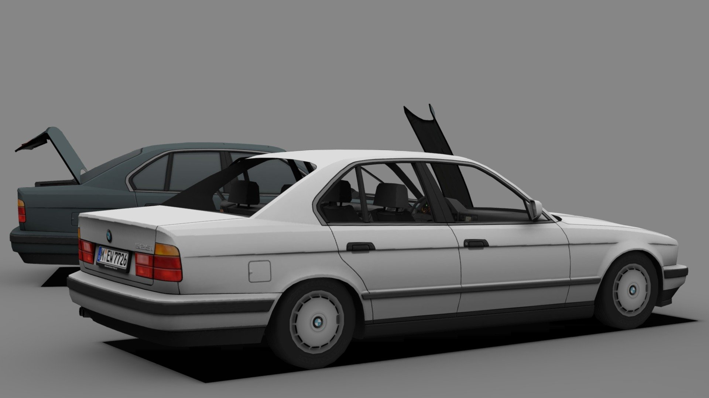

# E34 Physics Laboratory

[](https://github.com/RRG314/e34-physics-laboratory/actions/workflows/ci.yml)
[](LICENSE)
[](docs/PROJECT_STATUS.md)



E34 Physics Laboratory is an open research and education project built around one unusually rich teaching object: the BMW E34. It connects school physics, mathematics, vehicle systems, experiments, and engineering models in a single learning environment.

The idea is not to decorate ordinary lessons with pictures of a car. A learner studies motion to gain access to driving controls, uses rotational physics to understand the wheels and driveline, and applies momentum and energy to safe virtual ramp and impact experiments. As the physics becomes more demanding, the same vehicle model gains better evidence, more interacting systems, and more rigorous mathematics.

The project currently runs as a browser-based research prototype. It is not a finished course, a driving simulator, or a source of repair or safety advice.

The project is not an accredited school or credentialing body. Progress markers describe evidence produced inside the application; they are not degrees, professional qualifications, academic credit, or accredited certificates. Research claims, course completion, and future owner-issued acknowledgements must remain clearly separated.

[Try the laboratory on GitHub Pages](https://rrg314.github.io/e34-physics-laboratory/). The hosted demo and the local application are the same static build; neither requires an application server or account.

## What you can explore today

- A four-stage Foundation Path with visible prerequisites and persisted completion: wheel mathematics, motion, a controlled stop, and wheel telemetry.
- A guided sequence on position, displacement, speed, velocity, acceleration, and graph interpretation.
- A persistent evidence model that opens driving and inspection tools as the learner demonstrates understanding.
- A wheel-and-tire mathematics investigation that is the real prerequisite for later motion and wheel-system work, with free-response calculations, unit conversion, circle geometry, RPM, and interactive comparison of unloaded and loaded-radius models.
- A measurable driving assignment that requires the learner to reach a target speed and stop inside a defined position window before wheel inspection opens.
- Adjustable ramp, impact-pulse, and ideal-drop models with synchronized graphs and visible assumptions.
- Ten recurring mathematics-and-physics domain families, each mapped from high-school foundations through research depth.
- One consistent 525i whose model becomes more detailed as the learner's physics and mathematics advance.
- A notebook, data import, model comparison, uncertainty labels, and source records.

The [project status](docs/PROJECT_STATUS.md) separates working features from planned ones. The [educational audit](docs/EDUCATIONAL_AUDIT.md) explains what is and is not yet good enough for teaching, the research behind the curriculum direction, and the release gate for future chapters.

## Run the laboratory

You will need Node.js 22 or later.

```bash
git clone https://github.com/RRG314/e34-physics-laboratory.git
cd e34-physics-laboratory
npm ci
npm run dev
```

Open `http://localhost:5173`. On macOS, `Start E34 Physics Lab.command` provides the same local start-up flow.

After the first dependency install, the laboratory can be used without an internet connection:

```bash
npm run build
npm run preview
```

Open `http://localhost:4173`. The preview command serves the static files on your own computer; it is not a backend. Lessons, simulation, vehicle data, and graphics are included in the repository, and learner progress stays in that browser's local storage. A first `npm ci` still needs access to the npm packages unless they are already cached.

To run the full check locally:

```bash
npm run check
npx playwright install chromium
npm run test:e2e
```

## How the learning design works

The core lesson loop is:

`check readiness → observe → build the mathematics → predict → test → explain → transfer`

Each chapter starts with a physical question and ends with evidence that the learner can use the idea in a different situation. Mathematics is taught alongside the physics rather than hidden inside an answer checker. Vehicle upgrades act as applications and design constraints, not as arbitrary rewards.

The course structure draws on Physics Union Mathematics, OpenStax High School Physics, the Next Generation Science Standards, AP Physics, MIT OpenCourseWare, US Department of Education practice guides, and active-learning research. The [integrated mathematics and physics path](docs/INTEGRATED_MATH_PHYSICS_PATH.md) explains how those sources are combined; the shorter [learning design](docs/LEARNING_DESIGN.md) states the acceptance rules for lessons.

## Contributing

Contributions are welcome from educators, students, physicists, engineers, E34 owners, researchers, designers, and web developers. You do not need to work on the 3D application to make a useful contribution. Source review, lesson testing, accessibility feedback, vehicle measurements, and clearer explanations are equally valuable.

Please read [CONTRIBUTING.md](CONTRIBUTING.md) before opening a pull request. Good first contributions are listed in the [roadmap](docs/ROADMAP.md) and issue templates are provided for software bugs, curriculum proposals, and vehicle data.

## Documentation

- [Project overview](docs/PROJECT_OVERVIEW.md)
- [Current status and limitations](docs/PROJECT_STATUS.md)
- [Learning design and curriculum](docs/LEARNING_DESIGN.md)
- [Integrated mathematics and physics path](docs/INTEGRATED_MATH_PHYSICS_PATH.md)
- [Educational audit and priorities](docs/EDUCATIONAL_AUDIT.md)
- [Research and evidence methods](docs/RESEARCH_METHODS.md)
- [Vehicle data and visual assets](docs/VEHICLE_DATA.md)
- [525i release scope and evidence boundary](docs/VEHICLE_EVIDENCE_PLAN.md)
- [Technical guide](docs/TECHNICAL_GUIDE.md)
- [Roadmap](docs/ROADMAP.md)
- [Governance](docs/GOVERNANCE.md)

## Safety, names, and licensing

All crash, ramp, drop, and high-speed situations in this project are virtual. Do not reproduce them with a real vehicle. Simulation results are educational approximations and must not be used to make safety-critical engineering decisions.

BMW, E34, 5 Series, M5, and related marks belong to their respective owners. This independent educational project is not affiliated with or endorsed by BMW AG.

Original project code and writing are available under the [MIT License](LICENSE). Third-party material keeps its original license and attribution; see [THIRD_PARTY_NOTICES.md](THIRD_PARTY_NOTICES.md).
